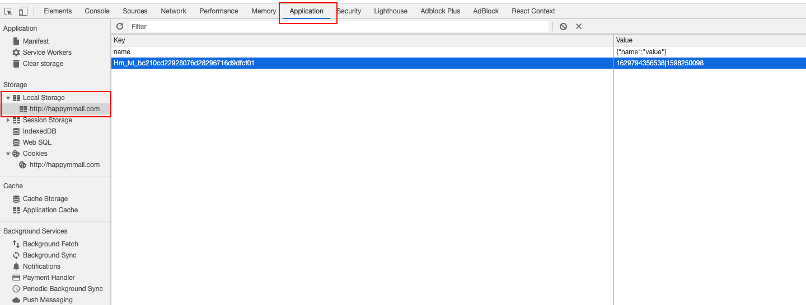
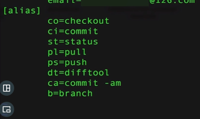

## 电商后台管理系统    

# 第一部分：功能介绍

### 一、技术栈   

### 二、功能模块
#### 2.1  用户登录模块    
- 登陆
- 退出
- 用户列表
#### 2.2 商品模块
- 商品列表
- 商品详情
- 添加/修改商品
#### 2.3 品类模块
- 品类列表
- 添加品类
- 修改品类名称
#### 2.4 订单模块
- 订单列表
- 订单详情
- 发货

# 第二部分：需要的知识储备

### 一、接口文档编写规范     

   
   


   

### 二、前端知识储备       

#### 2.1 页面加载过程
##### 资源加载过程
- url 解析，提取出里面的信息（具体提取什么信息呢），提取的是 url 里面包括的 协议、域名、端口号、路径、参数、哈希值。其中哈希值对后端没有什么用，他是前端的页面锚点，用来定位页面位置的
- DNS 查询，从 url 解析出的域名，去 DNS 查询对应的 IP 地址。      
           
    DNS 缓存和 DNS 服务器，一起组成了 DNS 系统，DNS 缓存不是只有一个，是有很多层的，浏览器有，路由器有，DNS 服务器有，不同的网络层级，DNS 的缓存时间也不一样，一般越靠近用户的节点缓存时间越短，比如浏览器的 DNS 缓存只有一分钟或者30秒，DNS 服务器缓存可以达到 10 分钟。在前端开发中，我们也会对 DNS 做优化，用 dns-prefetch。     
        
    dns-prefetch 会在页面一加载的时候，就会立即将 href 里面的内容做 dns 查询，并且缓存起来，等到真正请求这些资源的时候，就可以省去请求这些资源的时间，从而提高页面的加载速度
- 资源请求：去这个 IP 地址请求对应的资源，然后从服务器上把返回的资源下载下来。   
    
- 浏览器解析：浏览器根据请求回来的资源根据不同的类型做不同的解析
      
    js 文件会阻塞 dom，css 不会阻塞，会和 dom 并行开始

#### 2.2 ES6 常用语法     
- let const
- 箭头函数
    - 继承外层作用域的 this
    - 不能用作构造函数
    - 没有 prototype 属性
- promise   
  

#### 2.3 本地存储     

- cookie: 
    - 客户端保存请求信息的机制，
    - 键值对形式，
    - 存储在本地加密文件里面，
    - 有域名和路径的限制。
        - name：cookie 名称，
        - domain：cookie 生效的域名，一般二级域名可以使用一级域名的 cookie，但是不能操作其他二级域名的 cookie，也不能操作所属的三级域名的 cookie
        - path：指定了 cookie 生效的路径，如果同一域名下有不同路径的 cookie，也是不能相互操作的
        - expires：cookie 过期的时间，不指定时间的话，会在关闭浏览器的时候，cookie 就被删除
        - httpOnly：cookie 只能在服务端设置，浏览器不能修改
    - 查看 cookie：F12 -- 点击控制台那行的 Application -- 点击左侧的 cookie -- 下方出现当前的网址，点击就可以看到cookie
        使用 js 获取的 cookie 只有一行，但是通过上面的方法查看 cookie 却有很多
         
        
        有很多的 cookie，这里面的 cookie 有很多是 百度 的cookie，删除之后，就只剩下当前页面的域名（happymmall.com）下的cookie，也就是我们可一操作的 cookie，和 js 获取的 cookie 一样
            
        
    - cookie 的详细增删改查的操作：具体参考 test/本地存储/cookie-session.js
        - 1.获取 cookie 
           ` let cookie = document.cookie; `
        - 2.添加 cookie   
            ` document.cookie = 'name=jack' `, 这种设置的 cookie 没有其他设置，domain 默认就是当前的域名     
            ` document.cookie = 'name=tom;domain=happymmall.com;path=/index.html;' `
        - 3.修改 cookie   
        保证 domain 和 path 相同的情况下，可以修改 cookie 的值
        ` document.cookie = 'name=mac'; `
        
        - 4.删除 cookie
        将过期时间设置成 0，或者不是当前的时间，是之前的时间，就可以删除掉该条 cookie
        ` document.cookie = 'name=jack;expires=0'; `  
       
        
- session：
    - 服务器保存请求信息的机制
    - sessionId 通常放在 cookie 里。sessionID 也可以放在 http 的参数或者头部字段里面
    - 通过抓包工具 charles 来看请求头和响应头中的 cookie 信息是否有 sessionId
    
-  localstorage:
   有些信息在本地存储就可以，比如记录用户选中了那个菜单，或者用户喜欢哪个样式，完全是为了前端展示用的。如果这些信息记录在 cookie 中，那么这个页面的所有请求，都会带着这些和后端服务器没什么关系的  cookie 信息，发送给后端服务器，增大了网络请求的体积。所以在 h5 里面引入了新的本地存储 -- localstorage。
   - localstorage 有域名限制的，是需要完全匹配，而不是像 cookie 那样有继承性，只能在当前域名下使用
   - localstorage 被存在一个对象里面，也是键值对的形式，key-value 的形式，value 只能是基本类型，如果是引用类型，他会把引用类型的 toString 形式存储起来，这样引用类型存储的信息就消失了
   - localstorage 没有过期时间，只要不删除就一直存在，浏览器关闭以后，localstorage 不会消失
- sessionStorage：
    通过名字可以看出，sessionStorage 和 localStorage 是对应的，都是 h5 提出来的，localStorage 不消失，而 sessionStorage 浏览器关闭就会消失，语法上两者一样       
    
    使用方法可以看 test/本地存储/localstorage.js
    
    查看方法：
    
    

# 第三部分：前端框架分析    

# 第四部分：开发环境搭建    

## 一、git   
git 命令缩写配置


## 二、node-sass


## 三、webpack 设置

# 第五部分：react 基础     
用于处理视图层的框架

### 5.1 如何删除组建？
删除组建的思路是通过 state 的标志位来控制。给 state 设置字段 ` hasChild: true`，默认是有这个子组件。给删除按钮绑定事件，点击就改变这个标志位为 false。rend 函数渲染的时候可以这样写：    
```
render() {
    return (
        <div>
            {this.state.isChild ? <Component data={this.state.data} /> : null}
            <Data />
        </div>
    )
}
```

### 5.2 router   

- 页面 router：是真正的页面跳转，整个页面都会按照新的路径重新加载，会退的时候也是整个页面重新渲染
- hash router：跳转的时候只有路径的 哈希值在发生变化，而页面并没有重新加载，只是跳到了当前页面的哈希值的状态，后退的时候也只是跳到上一个 hash 状态，整个页面不会刷新
- H5 router：是 H5 提出来的路由，在 js 的 history 对象中提供一个新的方法，用来手动的在路由地址里面放进一个新的值，点击浏览器后退按钮的时候，可以通过 H5 router 提供的 onpopState 事件，来截获浏览器后退按钮触发的事件，保证在模拟路由的同时，不做页面的跳转，这样才能完成一个单页应用的要求，他相对 hash 路由而言，可以操作整个路径，他的功能和 hash 路由类似，只不过 hash 路由操作的是 hash，而 h5 路由可以操作 hash，也可以操作路径，但由于是 h5 提出来的，所以兼容性要比 hash 差一些
  代码示例：/test/

# 第六部分： 通用功能开发


# 第七部分： 基础功能模块开发


# 第八部分： 商品模块开发


# 第九部分：品类模块开发


# 第十部分：订单模块开发


# 第十一部分：后台管理系统的上线
